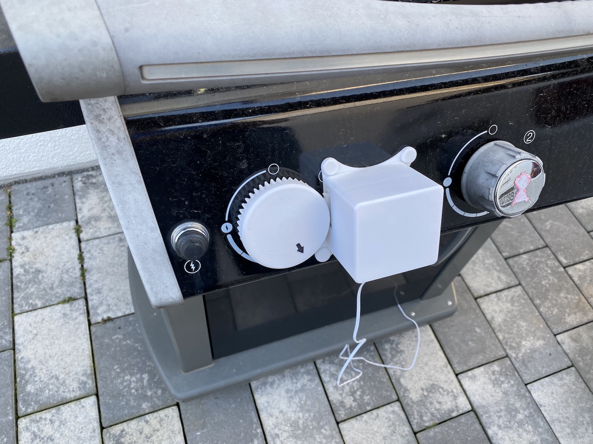
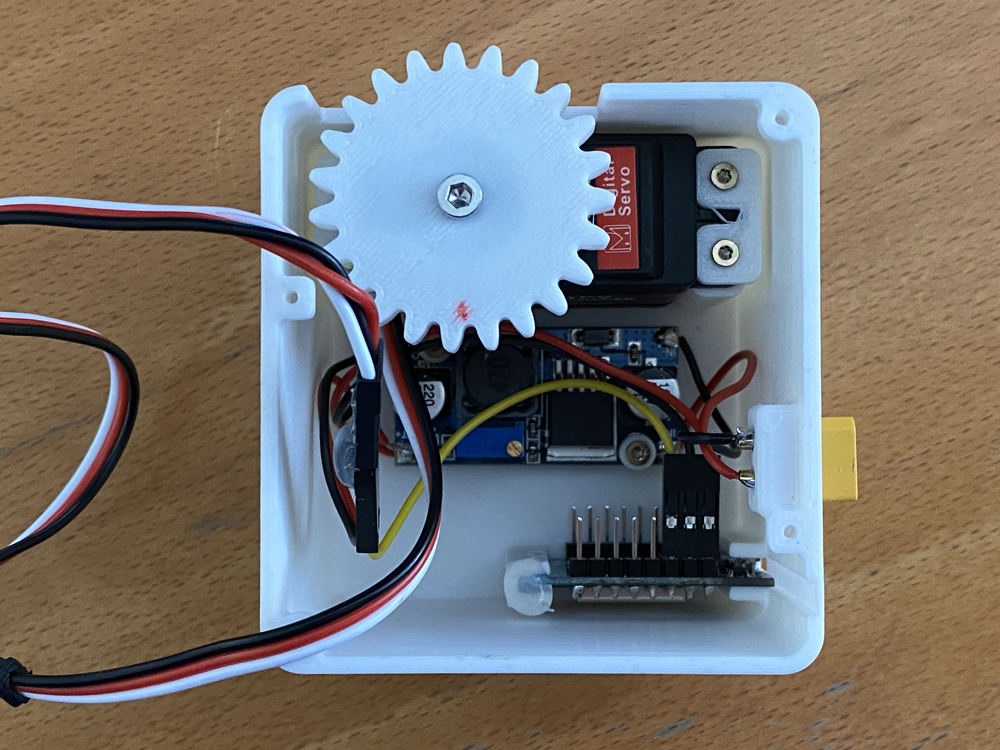
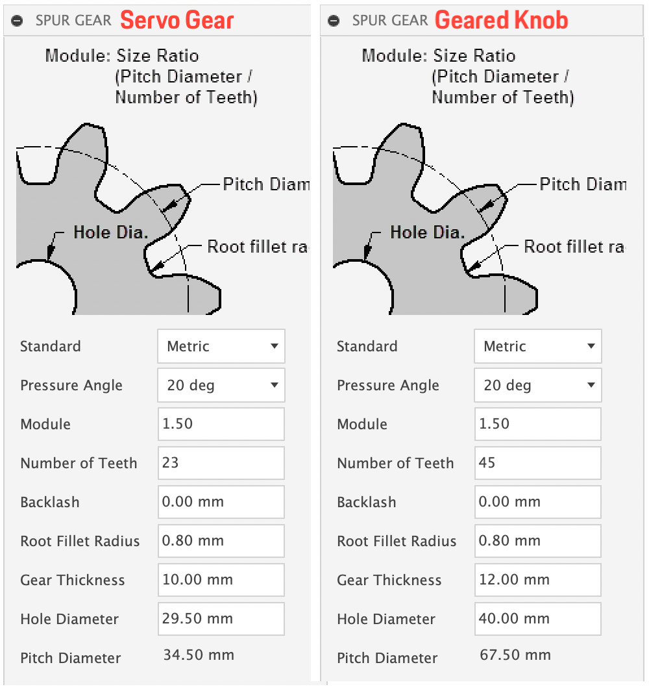

# BBQcontrol
### More beer - less turning knobs 🍺🤪

Mechanical controller with 3D-printed parts to control your BBQ over WiFi. The device uses a ESP8266, a servo and a buck converter for powering the device. The 3D-printed knob fits on a Weber Spirit E320 from 2014. Device control over MQTT.

 

### Features
- Connection over WiFi, communication over MQTT. I use [IoBroker](https://www.iobroker.net) for web-based control and visualisation.
- most parameters can be changed live via MQTT, like the step size and other
- time adjustable boost function
- compensation for knob backlash

### BOM
- ESP8266 or compatible, I use a Wemos D1 mini clone. There´s a slot in the case for the Wemos D1 mini.
- DC-DC buck converter LM2596 [AliExpress link](https://www.aliexpress.com/item/32792186556.html?spm=a2g0s.9042311.0.0.27424c4dV3YrsG)
- XT30 connector [AliExpress link](https://www.aliexpress.com/item/32773333544.html?spm=a2g0s.9042311.0.0.27424c4dV3YrsG)
- Servo DS3218 control angle 270° [Amazon link](https://www.amazon.de/gp/product/B07Q65JY1K/ref=ppx_yo_dt_b_asin_title_o04_s00?ie=UTF8&psc=1) I shortened the control arm to fit the small gear.
- 3D-printed parts, download from Thingiverse [here](https://www.thingiverse.com/thing:4780922)
- 4x neodymium magnets 10x3mm
- 10x 2x10mm screws for mounting servo, buck converter and bottom cover

### Power supply
I use a battery from my power drill, 18V 2.5Ah, which lasts probably more than 2 days.  If you have the same type of battery you can download 3D-printable adapter [here on Thingiverse](https://www.thingiverse.com/thing:4244545)

### Designing gears for your own BBQ
If you use AutoDesk Fusion 360, you can use the built-in gear-generator to design a custom knob which fits your BBQ. Below are the parameters I used for the gears:

